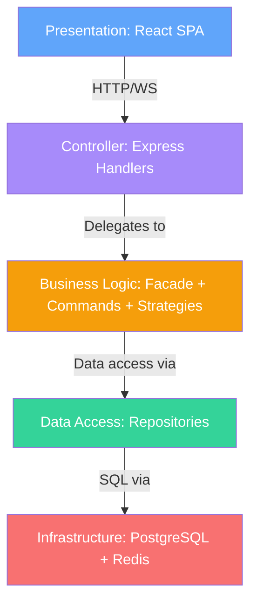
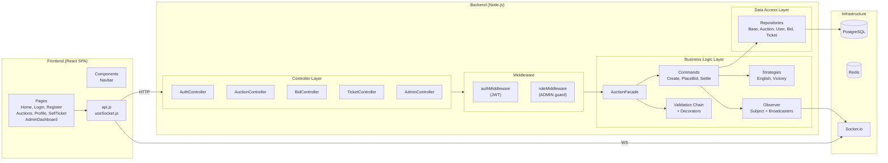
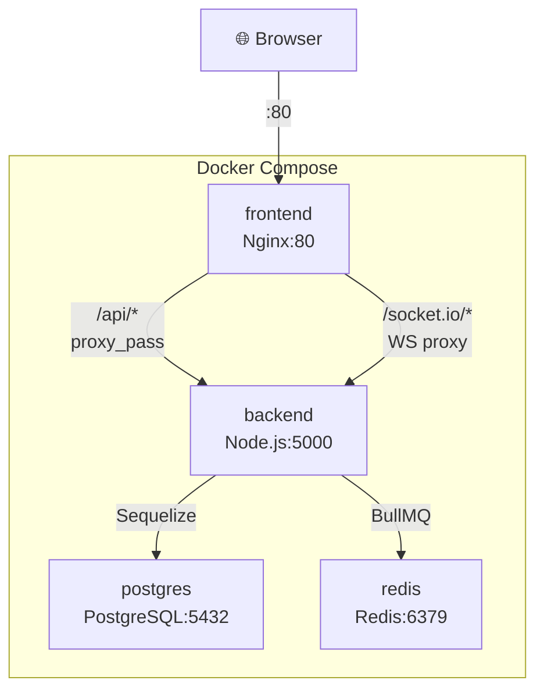

# 🏗️ Architecture Document — FairPlay Auctions Platform

> **Architecture Style:** Layered (N-Tier) Monolithic Architecture
> **Last Updated:** 20 April 2026

---

## Table of Contents

1. [Architecture Style Justification](#1-architecture-style-justification)
2. [Layered Architecture Breakdown](#2-layered-architecture-breakdown)
3. [Layer Dependency Rules](#3-layer-dependency-rules)
4. [Detailed Layer Description](#4-detailed-layer-description)
5. [Design Patterns by Layer](#5-design-patterns-by-layer)
6. [Component Diagram](#6-component-diagram)
7. [Request Flow Through Layers](#7-request-flow-through-layers)
8. [Deployment Architecture](#8-deployment-architecture)
9. [Technology Stack per Layer](#9-technology-stack-per-layer)
10. [Directory Structure Mapped to Layers](#10-directory-structure-mapped-to-layers)

---

## 1. Architecture Style Justification

### Why Layered (N-Tier) Monolithic?

The FairPlay Auctions platform follows a **Layered (N-Tier) Monolithic Architecture**. This means the application is organized into distinct horizontal layers, each with a clear responsibility, but deployed as a single unit per service (backend monolith + frontend SPA).

| Decision Factor | Our Choice | Rationale |
|----------------|------------|-----------|
| **Team Size** | Small (1–3 developers) | Monolith avoids the operational overhead of microservices |
| **Complexity** | Medium — auction logic + real-time bidding | Layers separate concerns cleanly without needing distributed services |
| **Real-time Requirements** | WebSocket for live bid updates | Socket.io lives inside the monolith, sharing the same process as the HTTP server — avoiding cross-service communication complexity |
| **Transactional Integrity** | ACID-compliant settlements | Single-process monolith can leverage Sequelize transactions with `FOR UPDATE` row locks — impossible to achieve this simply across microservices |
| **Deployment** | Docker containers | Monolith deployed as 2 containers (backend + frontend) + infrastructure (Postgres + Redis) |
| **Scalability Path** | Vertical first, horizontal later | The layered design allows extracting any layer into a microservice later without rewriting business logic |

### Why NOT Microservices?

- The app has **4 core entities** (User, Ticket, Auction, Bid) — not complex enough to warrant service decomposition.
- The settlement flow requires **multi-entity database transactions** (User wallets × Ticket ownership × Auction status) — this is trivial in a monolith but extremely complex across distributed services (Saga pattern, eventual consistency, etc.).
- A single Node.js process handles both HTTP and WebSocket traffic, eliminating the need for a separate real-time service.

---

## 2. Layered Architecture Breakdown

```
┌─────────────────────────────────────────────────────────────┐
│                    PRESENTATION LAYER                        │
│           React SPA (Vite) + Tailwind CSS                   │
│     Pages: Home, Login, Register, Auctions, Profile,        │
│            SellTicket, AdminDashboard                        │
│     Components: Navbar                                       │
│     Services: api.js (Axios + interceptors)                 │
│     Hooks: useSocket.js (WebSocket client)                  │
└────────────────────────┬────────────────────────────────────┘
                         │ HTTP REST / WebSocket
                         ▼
┌─────────────────────────────────────────────────────────────┐
│                    CONTROLLER LAYER                          │
│              Express Route Handlers                          │
│     AuthController, AuctionController, BidController,       │
│     TicketController, AdminController                       │
└────────────────────────┬────────────────────────────────────┘
                         │
                         ▼
┌─────────────────────────────────────────────────────────────┐
│                   BUSINESS LOGIC LAYER                       │
│                                                              │
│  ┌──────────────┐  ┌──────────┐  ┌──────────────────────┐  │
│  │ AuctionFacade│──│ Commands │──│ Strategies            │  │
│  │  (Facade)    │  │ (Command)│  │ (English / Vickrey)   │  │
│  └──────────────┘  └──────────┘  └──────────────────────┘  │
│  ┌──────────────┐  ┌──────────┐  ┌──────────────────────┐  │
│  │ Builders     │──│Decorators│──│ BidValidationChain   │  │
│  │ (Builder)    │  │(Logging/ │  │ (Chain of Resp.)     │  │
│  └──────────────┘  │Validation│  └──────────────────────┘  │
│  ┌──────────────┐  └──────────┘  ┌──────────────────────┐  │
│  │ Factories    │                │ AuctionSettlement     │  │
│  │ (Factory)    │                │ Service (Mediator)    │  │
│  └──────────────┘                └──────────────────────┘  │
│  ┌──────────────────────────────────────────────────────┐   │
│  │ Observer Pattern: AuctionSubject → Notification +    │   │
│  │                   WebSocket Broadcaster              │   │
│  └──────────────────────────────────────────────────────┘   │
└────────────────────────┬────────────────────────────────────┘
                         │
                         ▼
┌─────────────────────────────────────────────────────────────┐
│                   DATA ACCESS LAYER                          │
│             Repository Pattern + Sequelize ORM              │
│     BaseRepository, AuctionRepository, UserRepository,      │
│     BidRepository, TicketRepository                         │
└────────────────────────┬────────────────────────────────────┘
                         │
                         ▼
┌─────────────────────────────────────────────────────────────┐
│                   INFRASTRUCTURE LAYER                       │
│     PostgreSQL (RDBMS)  │  Redis (Job Queues via BullMQ)   │
│     Socket.io Server    │  JWT Authentication              │
└─────────────────────────────────────────────────────────────┘
```

---

## 3. Layer Dependency Rules

The layered architecture enforces **strict downward-only dependencies**:

| Rule | Description |
|------|-------------|
| **No upward calls** | A lower layer NEVER imports from or calls a higher layer. Repositories never call controllers. |
| **Adjacent access only** | Each layer primarily communicates with the layer directly below it. Controllers call the Facade, not repositories directly. |
| **Cross-cutting exceptions** | Middleware (auth, RBAC) and decorators (logging) span multiple layers but are injected at the controller boundary. |
| **Dependency Inversion** | Controllers depend on abstractions (Facade), not concrete implementations (repositories, models). |



---

## 4. Detailed Layer Description

### 4.1 Presentation Layer (Frontend)

**Technology:** React 19 + Vite 8 + Tailwind CSS 4
**Responsibility:** User interface, client-side routing, API communication, real-time updates.

| Component | Type | Role |
|-----------|------|------|
| `Home.jsx` | Page | Landing page with hero section and feature highlights |
| `Login.jsx` | Page | JWT-based authentication form |
| `Register.jsx` | Page | User registration with auto-wallet creation |
| `Auctions.jsx` | Page | Live auction listing with real-time bid updates via WebSocket |
| `Profile.jsx` | Page | User dashboard with wallet balance, top-up, and bid history |
| `SellTicket.jsx` | Page | Two-step form: create ticket → create auction (English/Vickrey) |
| `AdminDashboard.jsx` | Page | Admin-only analytics dashboard with RBAC guard |
| `Navbar.jsx` | Component | Navigation with auth-aware rendering and RBAC |
| `api.js` | Service | Axios instance with JWT interceptor + all API service modules |
| `useSocket.js` | Hook | WebSocket connection management per auction room |

**Key Design Decision:** The frontend uses a thin service layer (`api.js`) to centralize all HTTP calls. Components never call `axios` directly — they always go through the service module. This mirrors the Facade pattern on the backend.

---

### 4.2 Controller Layer (API Gateway)

**Technology:** Express.js Route Handlers
**Responsibility:** HTTP request/response handling, input extraction, error formatting.

| Controller | Routes | Responsibilities |
|------------|--------|-------------------|
| `AuthController` | `/api/auth/*` | Register, login, logout, profile, topUp, JWT generation |
| `AuctionController` | `/api/auctions/*` | Create auction, list active auctions, close/settle auction |
| `BidController` | `/api/bids/*` | Place manual bid, set proxy bid limit |
| `TicketController` | `/api/tickets/*` | Create ticket, list available tickets |
| `AdminController` | `/api/admin/*` | Get analytics, list all auctions (ADMIN only) |

**Key Design Decision:** Controllers are **thin** — they extract params from `req`, call the Facade, and format the response. No business logic lives here. This makes controllers easy to test and swap.

---

### 4.3 Business Logic Layer

**Technology:** Pure JavaScript classes implementing GoF design patterns
**Responsibility:** All auction business rules, validation, orchestration, and event processing.

| Sub-component | Pattern | Responsibility |
|---------------|---------|---------------|
| `AuctionFacade` | Facade | Single entry point for controllers; orchestrates all lower components |
| `CommandInvoker` | Command | Executes commands with history tracking |
| `CreateAuctionCommand` | Command | Orchestrates Builder → Factory for auction creation |
| `PlaceBidCommand` | Command | Handles transactional bid placement with observer notification |
| `SettleAuctionCommand` | Command | Delegates to settlement service for auction closing |
| `AuctionBuilder` | Builder | Step-by-step auction config construction with validation |
| `StrategyFactory` | Factory | Creates strategy instances by type name |
| `AuctionFactory` | Factory | Creates auctions with ticket ownership validation |
| `EnglishAuctionStrategy` | Strategy | Ascending bid validation + highest-bidder-wins |
| `VickreyAuctionStrategy` | Strategy | Sealed-bid validation + second-price settlement |
| `AuctionContext` | Strategy (Context) | Delegates to active strategy without knowing the type |
| `AuctionSettlementService` | Mediator | Multi-entity transactional settlement (wallet + ticket + auction) |
| `ProxyBiddingEngine` | Domain Logic | Auto-bidding engine within same transaction |
| `AuctionSubject` | Observer (Subject) | Maintains subscriber list, notifies on bid/close events |
| `NotificationService` | Observer | Logs notifications for bid events |
| `WebSocketBroadcaster` | Observer | Broadcasts events to WebSocket rooms |
| `BidValidationChain` | Chain of Responsibility | Sequential bid validation (5 handlers) |
| `LoggingDecorator` | Decorator | Transparent logging proxy for any service |
| `ValidationDecorator` | Decorator | Pre-condition validation for bid operations |

**Key Design Decision:** The business layer uses **10 GoF design patterns** to keep each class focused on a single responsibility. This makes the system highly testable — every component can be unit-tested in isolation.

---

### 4.4 Data Access Layer

**Technology:** Sequelize ORM with Repository Pattern
**Responsibility:** Database queries, data mapping, query abstraction.

| Repository | Model | Key Methods |
|------------|-------|-------------|
| `BaseRepository` | Generic | `findById`, `findAll`, `findOne`, `create`, `update`, `delete`, `count` |
| `AuctionRepository` | Auction | `findActiveAuctions`, `findWithTicket`, `findByIdForUpdate`, `countActive`, `countClosed`, `getTotalVolume` |
| `UserRepository` | User | `findByEmail`, `updateWallet`, `getTotalUsers` |
| `BidRepository` | Bid | `findByAuction`, `findHighestBid` |
| `TicketRepository` | Ticket | `findAvailableTickets`, `findWithSeller` |

**Key Design Decision:** All repositories extend `BaseRepository`, inheriting standard CRUD operations. Domain-specific queries are added in subclasses. Controllers and services **never call Sequelize models directly** — they go through repositories. This makes it possible to swap the database implementation without changing business logic.

---

### 4.5 Infrastructure Layer

| Technology | Role |
|-----------|------|
| **PostgreSQL 16** | Primary RDBMS with ACID transactions, row-level locking (`FOR UPDATE`) |
| **Redis 7** | Background job queue (BullMQ) for settlement emails and receipt PDF generation |
| **Socket.io** | Real-time bidirectional communication for live auction updates |
| **JWT** | Stateless authentication with `authMiddleware` guard |
| **bcrypt** | Password hashing in User model hooks |

---

## 5. Design Patterns by Layer

| Layer | Patterns Used |
|-------|--------------|
| **Presentation** | Component-Based UI, Service Module (quasi-Facade), Custom Hooks |
| **Controller** | Thin Controller, Middleware Chain (auth + RBAC) |
| **Business Logic** | Facade, Strategy, Observer, Command, Builder, Factory, Decorator, Chain of Responsibility, Mediator |
| **Data Access** | Repository, Template Method (BaseRepository inheritance) |
| **Infrastructure** | Singleton (Sequelize instance, StrategyFactory), Proxy (LoggingDecorator wraps repos) |

---

## 6. Component Diagram



---

## 7. Request Flow Through Layers

### Example: Placing a Bid (POST /api/bids)

```
Browser (React)
  └── api.js: bidService.placeBid({ auctionId, amount })
       └── HTTP POST /api/bids
            └── Express Router (bidRoutes.js)
                 └── authMiddleware.protect() → verifies JWT, sets req.user
                      └── BidController.placeBid(req, res)
                           └── AuctionFacade.placeBid(auctionId, amount, userId)
                                ├── ValidationDecorator.validateBidPreconditions()
                                │    └── Auction.findByPk() + User.findByPk()
                                ├── buildBidValidationChain().handle()
                                │    ├── AuctionActiveHandler → pass
                                │    ├── AuctionNotExpiredHandler → pass
                                │    ├── SufficientBalanceHandler → pass
                                │    └── MinimumBidHandler → pass
                                └── CommandInvoker.executeCommand(PlaceBidCommand)
                                     └── PlaceBidCommand.execute()
                                          ├── sequelize.transaction()
                                          ├── AuctionRepository.findByIdForUpdate()
                                          ├── AuctionContext.setStrategy() → validateBid()
                                          ├── Bid.create() + Auction.update()
                                          ├── ProxyBiddingEngine.processProxyBids()
                                          ├── transaction.commit()
                                          └── AuctionSubject.notifyNewBid()
                                               ├── NotificationService.onNewBid()
                                               └── WebSocketBroadcaster.onNewBid()
                                                    └── io.to(auctionId).emit('new_bid')
                                                         └── Browser receives WebSocket event
                                                              └── React state updates → UI re-renders
```

---

## 8. Deployment Architecture

### Docker Compose (Local / Self-Hosted)



### Free Cloud Deployment (Render.com)

| Service | Platform | URL |
|---------|----------|-----|
| **Backend** | Render Web Service (Free) | `https://fairplay-api.onrender.com` |
| **Frontend** | Render Static Site (Free) | `https://fairplay-auctions.onrender.com` |
| **Database** | Render PostgreSQL (Free) | Internal connection string |
| **Redis** | Render Redis (Free) / Upstash | Internal connection string |

---

## 9. Technology Stack per Layer

| Layer | Technology | Version |
|-------|-----------|---------|
| **Presentation** | React | 19.2.4 |
| **Presentation** | Vite | 8.0.0 |
| **Presentation** | Tailwind CSS | 4.2.1 |
| **Presentation** | React Router | 7.13.1 |
| **Presentation** | Socket.io Client | 4.8.3 |
| **Controller** | Express.js | 4.x |
| **Business Logic** | Pure JavaScript (GoF Patterns) | — |
| **Data Access** | Sequelize ORM | 6.x |
| **Infrastructure** | PostgreSQL | 16 |
| **Infrastructure** | Redis | 7 |
| **Infrastructure** | BullMQ | latest |
| **Infrastructure** | Socket.io Server | 4.x |
| **Testing (Backend)** | Jest | 30.3.0 |
| **Testing (Frontend)** | Vitest | 4.1.4 |
| **Containerization** | Docker + Docker Compose | latest |

---

## 10. Directory Structure Mapped to Layers

```
FairPlay Auctions/
├── docker-compose.yml                # Deployment orchestration
│
├── backend/                          # MONOLITH BACKEND
│   ├── Dockerfile                    # Container definition
│   ├── .dockerignore
│   ├── server.js                     # INFRASTRUCTURE: HTTP + WebSocket bootstrap
│   ├── app.js                        # CONTROLLER: Express app + route binding
│   ├── config/
│   │   └── db.js                     # INFRASTRUCTURE: Sequelize connection
│   ├── models/                       # DATA ACCESS: Sequelize model definitions
│   │   ├── index.js                  # Model registration + associations
│   │   ├── User.js
│   │   ├── Auction.js
│   │   ├── Ticket.js
│   │   ├── Bid.js
│   │   └── ProxyBidLimit.js
│   ├── repositories/                 # DATA ACCESS: Repository Pattern
│   │   ├── BaseRepository.js
│   │   ├── AuctionRepository.js
│   │   ├── UserRepository.js
│   │   ├── BidRepository.js
│   │   └── TicketRepository.js
│   ├── services/                     # BUSINESS LOGIC: Core domain services
│   │   ├── AuctionContext.js         # Strategy Context
│   │   ├── EnglishAuctionStrategy.js # Strategy: English
│   │   ├── VickreyAuctionStrategy.js # Strategy: Vickrey
│   │   ├── AuctionSettlementService.js # Mediator
│   │   ├── ProxyBiddingEngine.js     # Domain Logic
│   │   ├── ObserverRegistry.js       # Observer Subject
│   │   ├── NotificationService.js    # Observer: Logging
│   │   ├── WebSocketBroadcaster.js   # Observer: WebSocket
│   │   ├── AuctionScheduler.js       # Cron for auto-settlement
│   │   └── JobQueueService.js        # BullMQ integration
│   ├── commands/                     # BUSINESS LOGIC: Command Pattern
│   │   ├── CommandInvoker.js
│   │   ├── CreateAuctionCommand.js
│   │   ├── PlaceBidCommand.js
│   │   └── SettleAuctionCommand.js
│   ├── facades/                      # BUSINESS LOGIC: Facade Pattern
│   │   └── AuctionFacade.js
│   ├── factories/                    # BUSINESS LOGIC: Factory Pattern
│   │   ├── StrategyFactory.js
│   │   └── AuctionFactory.js
│   ├── builders/                     # BUSINESS LOGIC: Builder Pattern
│   │   └── AuctionBuilder.js
│   ├── decorators/                   # BUSINESS LOGIC: Decorator Pattern
│   │   ├── LoggingDecorator.js
│   │   └── ValidationDecorator.js
│   ├── middleware/                    # BUSINESS LOGIC: Chain of Responsibility
│   │   └── BidValidationChain.js
│   ├── controllers/                  # CONTROLLER LAYER
│   │   ├── AuthController.js
│   │   ├── AuctionController.js
│   │   ├── BidController.js
│   │   ├── TicketController.js
│   │   └── AdminController.js
│   ├── routes/                       # CONTROLLER: Route definitions
│   │   ├── authRoutes.js
│   │   ├── auctionRoutes.js
│   │   ├── bidRoutes.js
│   │   ├── ticketRoutes.js
│   │   └── adminRoutes.js
│   └── utils/                        # CROSS-CUTTING: Auth + RBAC middleware
│       ├── authMiddleware.js
│       └── roleMiddleware.js
│
└── frontend/                         # PRESENTATION LAYER
    ├── Dockerfile
    ├── .dockerignore
    ├── nginx.conf                    # Production serving config
    ├── vite.config.js
    ├── package.json
    └── src/
        ├── App.jsx                   # Router root
        ├── main.jsx                  # Entry point
        ├── index.css                 # Global styles
        ├── App.css                   # Theme + design system
        ├── pages/                    # Page components
        │   ├── Home.jsx
        │   ├── Login.jsx
        │   ├── Register.jsx
        │   ├── Auctions.jsx
        │   ├── Profile.jsx
        │   ├── SellTicket.jsx
        │   └── AdminDashboard.jsx
        ├── components/               # Reusable components
        │   └── Navbar.jsx
        ├── services/                 # API service layer
        │   └── api.js
        └── utils/                    # Custom hooks
            └── useSocket.js
```
