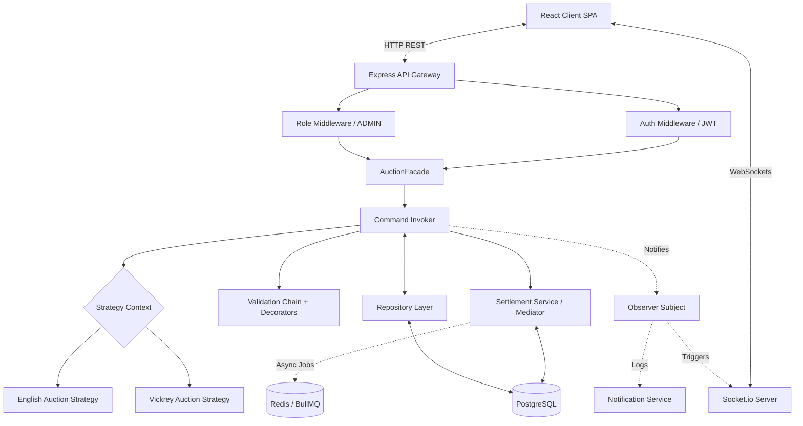
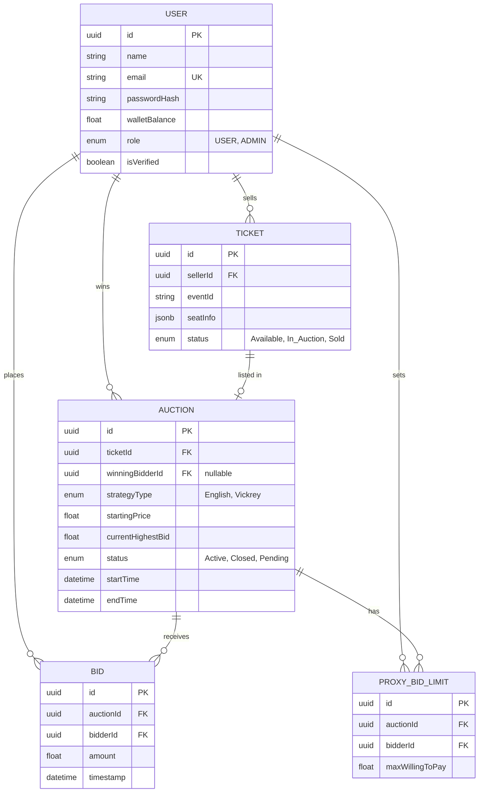
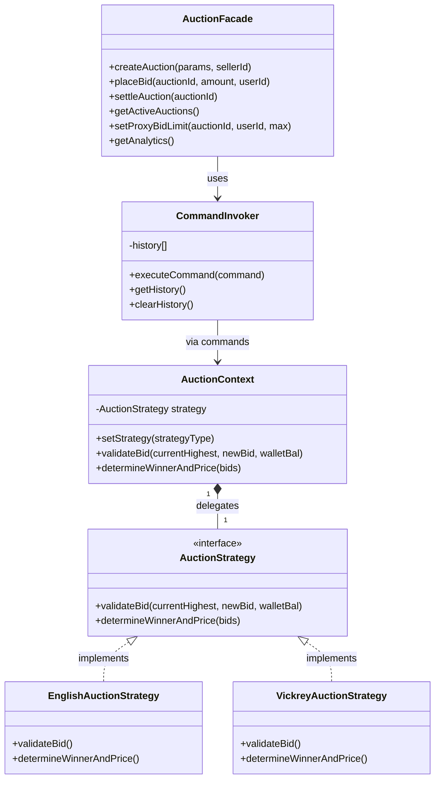
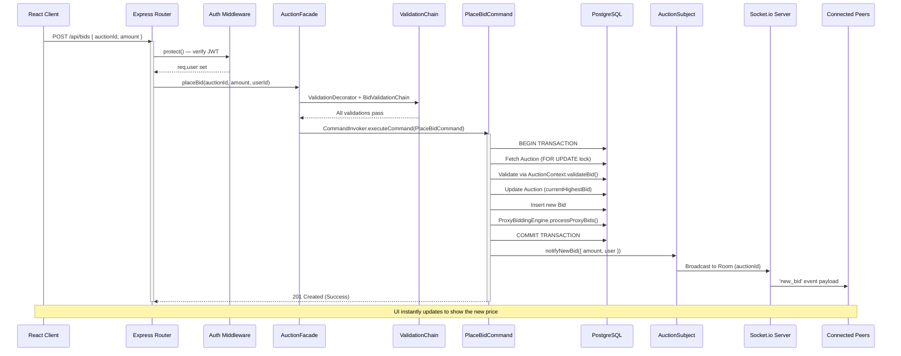
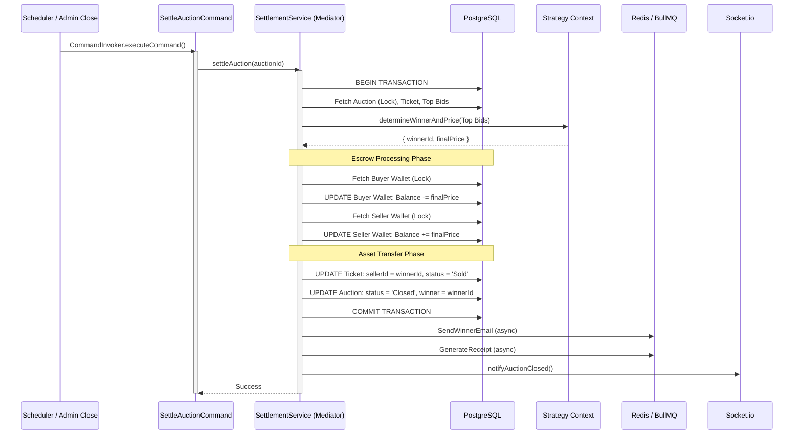

# FairPlay Auctions: Comprehensive System Design Document

## 1. Executive Summary & Purpose
This document provides a comprehensive architectural and design overview of the **FairPlay Ticket Auction Platform**. It outlines the technology choices, structural patterns, database design, interaction flows, Docker deployment, and testing infrastructure necessary to fulfill the requirements of a high-concurrency, real-time ticket auction system.

**Last Updated:** 20 April 2026

---

## 2. Architecture Justification ("The Why")

### 2.1 Architecture Style
The platform follows a **Layered (N-Tier) Monolithic Architecture** — see [ARCHITECTURE.md](ARCHITECTURE.md) for the full breakdown. The backend is organized into 5 horizontal layers: Presentation → Controller → Business Logic → Data Access → Infrastructure.

### 2.2 Technology Stack
*   **React.js (Frontend UI):** Chosen for its component-based architecture enabling a highly responsive, single-page application (SPA). Vite 8 is used for instant server start and lightning-fast HMR.
*   **Node.js & Express.js (Backend API):** Chosen for its non-blocking, event-driven I/O model, which is perfectly suited for managing high volumes of concurrent asynchronous requests—like those generated during the final seconds of a high-demand ticket auction.
*   **PostgreSQL (Database Layer):** Ticket auctions and wallet settlements require strict, guaranteed **ACID properties** (Atomicity, Consistency, Isolation, Durability) at the database level. Row-locking (`SELECT ... FOR UPDATE`) prevents race conditions during concurrent bid placements.
*   **Socket.io (Real-Time Engine):** WebSocket abstraction with long-polling fallbacks. Essential for broadcasting live price updates to all connected clients instantly, eliminating the need for inefficient HTTP polling.
*   **Redis + BullMQ (Background Processing):** Distributed job queues for asynchronous post-settlement tasks like winner email notifications and receipt PDF generation.
*   **Docker + Docker Compose (Containerization):** Multi-container deployment with health checks, dependency ordering, and persistent volumes.

### 2.3 Design Patterns (GoF)
The backend implements **10 Gang of Four (GoF) design patterns** across the business logic layer:

| Pattern | Category | Implementation | Purpose |
|---------|----------|---------------|---------|
| Strategy | Behavioral | `EnglishAuctionStrategy`, `VickreyAuctionStrategy`, `AuctionContext` | Isolates bidding rules per auction type; easily extensible for new types |
| Observer | Behavioral | `AuctionSubject`, `NotificationService`, `WebSocketBroadcaster` | Decouples REST bid processing from WebSocket broadcasting |
| Command | Behavioral | `CommandInvoker`, `CreateAuctionCommand`, `PlaceBidCommand`, `SettleAuctionCommand` | Encapsulates operations as objects with undo/history tracking |
| Factory | Creational | `StrategyFactory`, `AuctionFactory` | Centralizes object creation with validation |
| Builder | Creational | `AuctionBuilder` | Step-by-step auction configuration with field validation |
| Decorator | Structural | `LoggingDecorator`, `ValidationDecorator` | Adds cross-cutting concerns transparently |
| Facade | Structural | `AuctionFacade` | Single entry point for all controller operations |
| Chain of Responsibility | Behavioral | `BidValidationChain` (5 handlers) | Sequential pre-bid validation chain |
| Mediator | Behavioral | `AuctionSettlementService` | Multi-entity transactional settlement coordination |
| Repository | Architectural | `BaseRepository` + 4 domain repos | Database-agnostic data access abstraction |

---

## 3. High-Level System Architecture Diagram



---

## 4. Database Entity Relationship Diagram (ERD)



---

## 5. Detailed UML & Interaction Sequences

### 5.1 Class Diagram (Strategy + Command Pattern)



### 5.2 Sequence Diagram: Real-Time Bidding Flow



### 5.3 Sequence Diagram: Auction Settlement (Mediator)



---

## 6. Security Considerations & Protections

| Threat | Mitigation |
|--------|-----------|
| **Race Conditions** | PostgreSQL explicit locks (`SELECT ... FOR UPDATE`) during bid placements and settlement within database transactions |
| **Unauthorized Access** | JWT authentication via `authMiddleware.protect()` on all sensitive routes |
| **Privilege Escalation** | RBAC via `roleMiddleware.adminGuard()` restricting admin routes to `ADMIN` role |
| **Escrow Fraud** | Settlement mediator forces all-or-nothing rollback — if any step fails, all wallet changes revert |
| **Password Security** | bcrypt hashing with salts in User model `beforeCreate` hook |
| **XSS/Injection** | Express `express.json()` body parsing; Sequelize parameterized queries prevent SQL injection |

---

## 7. Containerization & Deployment

### 7.1 Docker Architecture

| Container | Image | Port | Purpose |
|-----------|-------|------|---------|
| `fairplay-frontend` | `nginx:alpine` | 80 | Serves React build + proxies API/WS |
| `fairplay-backend` | `node:20-alpine` | 5000 | Express API + Socket.io server |
| `fairplay-db` | `postgres:16-alpine` | 5432 | PostgreSQL with persistent volume |
| `fairplay-redis` | `redis:7-alpine` | 6379 | BullMQ job queues |

### 7.2 Running with Docker

```bash
# Build and start all services
docker-compose up --build

# Run in background
docker-compose up -d

# View logs
docker-compose logs -f backend

# Stop all
docker-compose down
```

---

## 8. Testing Infrastructure

| Metric | Backend | Frontend | Total |
|--------|---------|----------|-------|
| **Framework** | Jest 30.3 | Vitest 4.1 | — |
| **Test Suites** | 27 | 9 | **36** |
| **Tests** | 190 | 67+ | **257+** |
| **Pass Rate** | 100% | 100% | **100%** |

See [TEST_DOCUMENTATION.md](TEST_DOCUMENTATION.md) for the full exhaustive test report.
