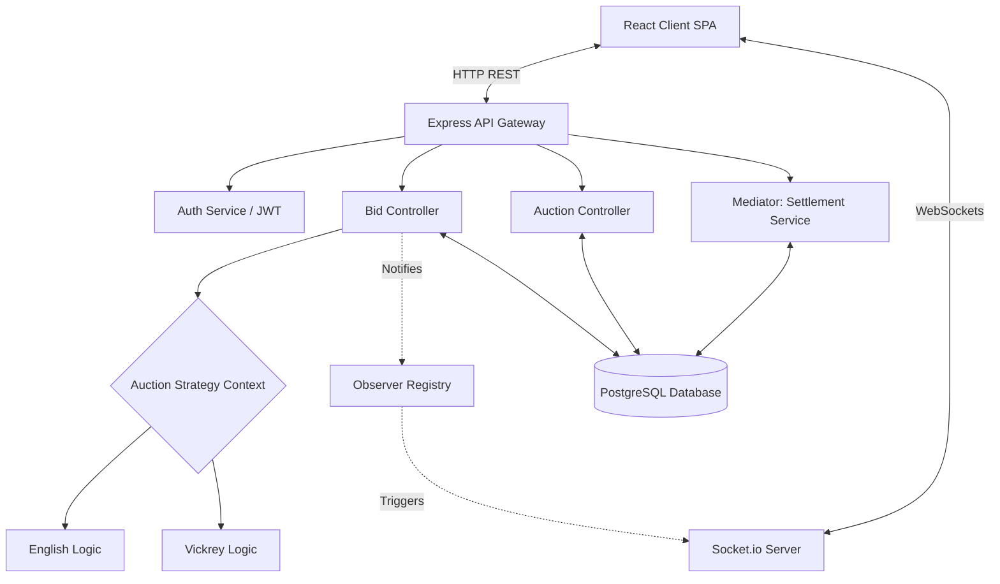
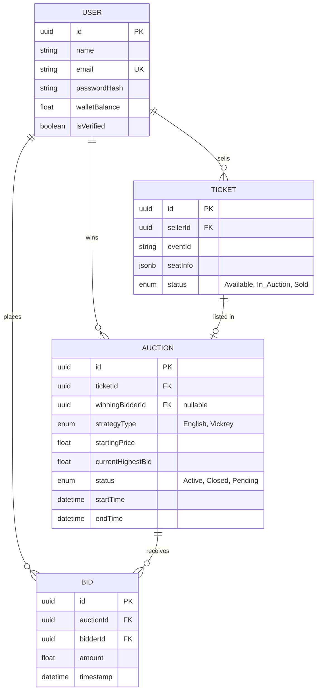
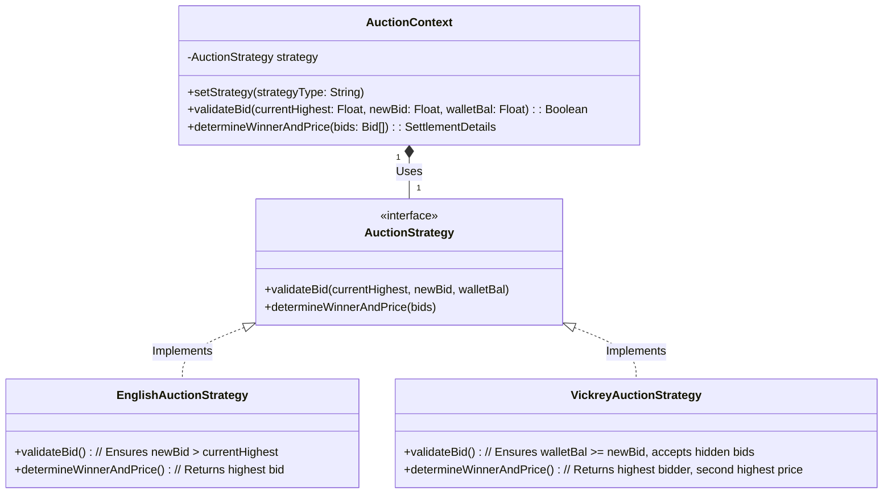
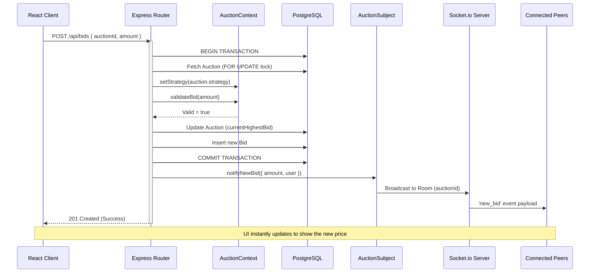
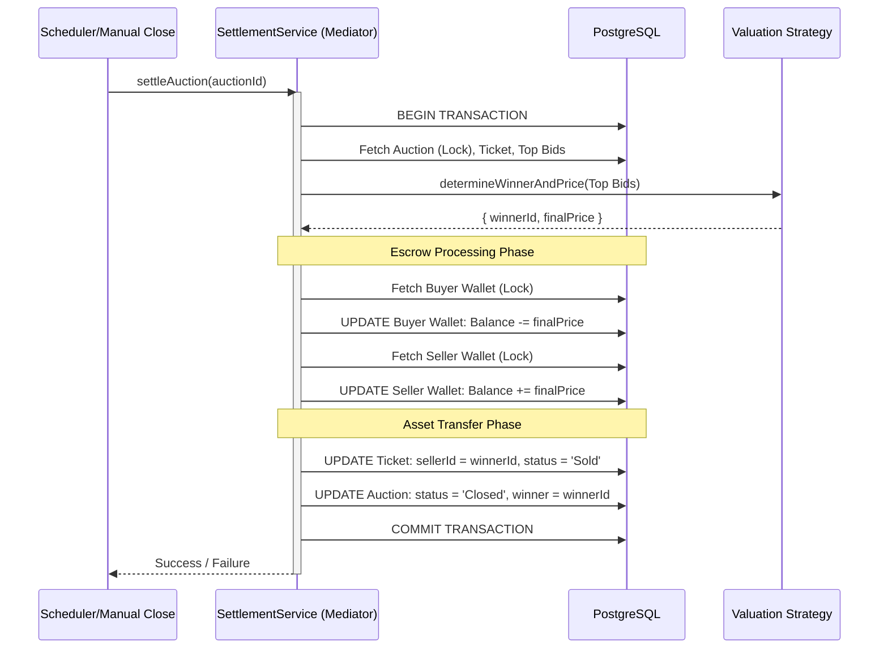

# FairPlay Auctions: Comprehensive System Design Document

## 1. Executive Summary & Purpose
This document provides a comprehensive architectural and design overview of the **FairPlay Ticket Auction Platform**. It outlines the technology choices, structural patterns, database design, and interaction flows necessary to fulfill the requirements of a high-concurrency, real-time ticket auction system.

---

## 2. Architecture Justification ("The Why")

### 2.1 Technology Stack
*   **React.js (Frontend UI):** Chosen for its component-based architecture enabling a highly responsive, single-page application (SPA). Vite is used over CRA for drastically improved build and HMR (Hot Module Replacement) speeds.
*   **Node.js & Express.js (Backend API):** Chosen for its non-blocking, event-driven I/O model, which is perfectly suited for managing high volumes of concurrent asynchronous requests—like those generated during the final seconds of a high-demand ticket auction.
*   **PostgreSQL (Database Layer):** Originally planned as MongoDB, migrated to **PostgreSQL**. Why? Ticket auctions and wallet settlements require strict, guaranteed **ACID properties** (Atomicity, Consistency, Isolation, Durability) at the database level. Relational databases with explicit row-locking prevent race conditions (e.g., two users bidding the exact same amount at the exact same millisecond).
*   **Socket.io (Real-Time Engine):** Long-polling fallbacks and WebSocket abstraction. Essential for broadcasting live price updates to all connected clients viewing an auction instantly, eliminating the need for inefficient HTTP polling.

### 2.2 Design Patterns (GoF)
We strictly adhered to Gang of Four (GoF) principles to keep the complex backend logic maintainable:
1.  **Strategy Pattern:** Used to isolate the logic between English (Ascending) and Vickrey (Sealed-bid) auctions. This allows the system to easily add a "Dutch Auction" or "Buy It Now" model later without altering core bid processing code.
2.  **Observer Pattern:** Used to decouple the REST API bid-processing logic from the WebSocket broadcasting logic. When a bid saves to DB, it emits an event. The WebSocket service "observes" this and pushes it to clients without the HTTP route needing to know about WebSockets.
3.  **Mediator Pattern:** Used in the [AuctionSettlementService](file:///d:/6th%20sem/Software/Project/backend/services/AuctionSettlementService.js#5-90). It encapsulates the complex interactions between Users (Wallets), Tickets (Ownership), and Auctions (Status) during the escrow checkout phase inside a single transactional boundary.

---

## 3. High-Level System Architecture Diagram

This diagram shows how the client interacts with our backend services.

---

## 4. Database Entity Relationship Diagram (ERD)

The relational schema ensuring data integrity.

---

## 5. Detailed UML & Interaction Sequences

### 5.1 Class Diagram (Strategy Pattern Implementation)
This displays how the system processes bids dynamically based on the auction type.

### 5.2 Sequence Diagram: Real-Time Bidding Flow
This sequence demonstrates the REST POST request coupled with the Observer pattern for WebSocket broadcasting.

### 5.3 Sequence Diagram: Auction Settlement (Mediator)
This diagram maps out exactly what happens when time runs out on an auction, handled by the [AuctionSettlementService](file:///d:/6th%20sem/Software/Project/backend/services/AuctionSettlementService.js#5-90).

---

## 6. Security Considerations & Protections
*   **Race Conditions:** Mitigated using PostgreSQL explicit locks (`SELECT ... FOR UPDATE`) during bid placements and checkout to prevent DB inconsistencies when 100 users bid simultaneously.
*   **JWT Authentication:** All sensitive routes (bidding, selling, wallet access) restrict execution via a Bearer token verification middleware.
*   **Escrow Safety:** The Settlement mediator forces an all-or-nothing rollback. If transferring the ticket fails due to an error, the buyer's funds are instantly rolled back in the transaction.
